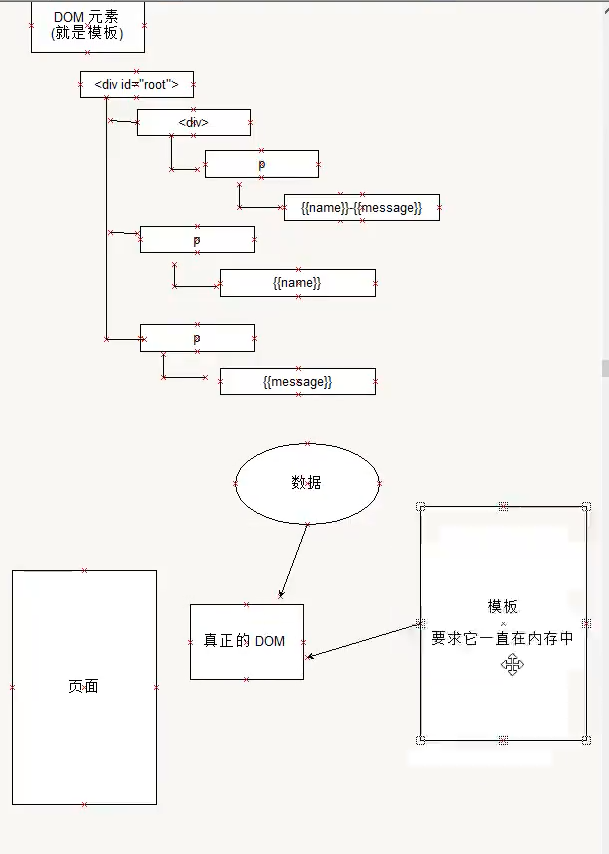
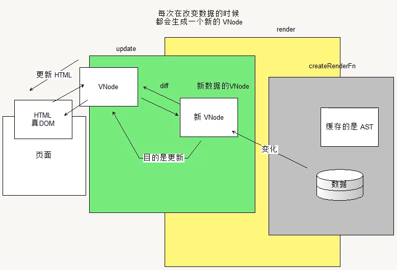
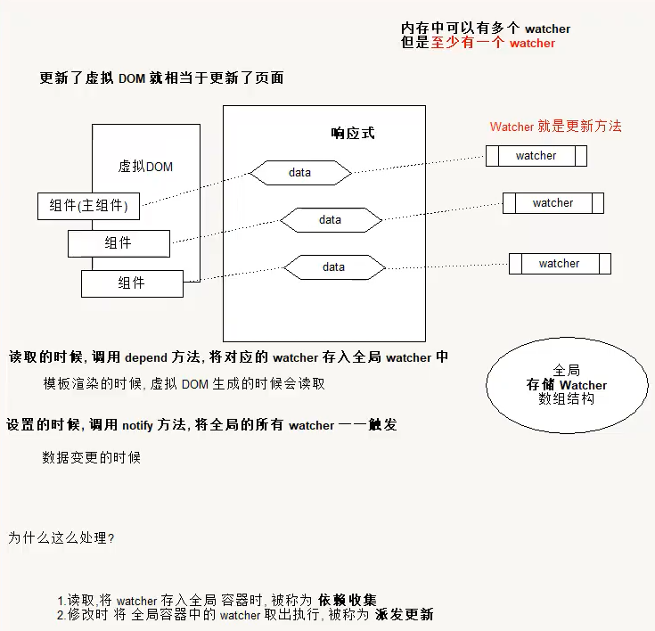

# vue与模板

## 使用步骤

1. 编写 页面 模板
   1. 直接在 html 标签中写
   2. 使用tenplate
   3. 使用单文件 (<tenplate />)
2. 创建 Vue 实例

   1. 在Vue的构造函数中提供:data,methods,computed,watcher,props
3. 将Vue 挂在到 页面（mounted）
```html
//第一步，创建模板 
<div id="app">
    <p>
        {{name}}
    </p>
    <p>
        {{message}}
    </p>
</div>
<script>
    // 第二部，创建Vue 实例
	let app = new Vue({
        el:'#app',
        data:{
            name:'黄',
            message:'张三'
        }
    })
    // 第三步:挂载，这种用法的挂载在Vue.js中帮我们实现了
</script>
```

# 数据驱动

## Vue的执行流程



1. 获得模板：模板中有“坑”
2. 利用Vue构造函数中提供的数据来“填坑”，得到可以在页面中显示的“标签了”
3. 将标签替换页面中原来有坑的标签

Vue 利用我们提供的数据 和 页面中 模板 生成了一个性的 HTML标签 （node 元素）替换到了 页面 中的放置模板的位置

我们如何实现Vue的数据驱动

## 1. 简化1

**没有完善的**

- Vue 使用的是 虚拟 DOM
-  我们现在只考虑到了单属性 ({{ name }}),而 Vue 中使用了大量的层级 ({{child.name.frisname}})
- 代码没有整合

`index.html`

```html
<div id="root">
    <div>
        <div>
            <div>
                <p>{{name}} - {{message}}</p>
            </div>
        </div>
    </div>
    <p>{{name}}</p>
    <p>{{message}}</p>
</div>
```
`Vue.js`

```js
//步骤拆解
// 1. 拿到模板
// 2. 拿到数据
// 3. 将数据和模板结合，得到的时HTML元素
// 4. 放在页面中


// let app = new Vue({
//     el:'#root',
//     data:{
//         name:'张三',
//         message:'是一个男人'
//     }
// })

let rkuohao = /\{\{(.+?)\}\}/g;

// 1. 获取模板
let tmpNode = document.querySelector('#root');
// 2. 拿到数据
let data = {
    name:'张三',
    message:'是一个男人'
}

// 3. 将数据放到模板中
// 使用递归方法
// 在现在的这个案例当中，template 是DOM 元素
// 在真正的Vue 源码当中 是 DOM -> 字符串模板 -> VNode -> 真正的DOM

function compiler( template,data ){
    let chileNode = template.childNodes; // 取出子元素
    for(let i = 0;i<chileNode.length;i++){
        //  nodeType 节点类型 1 元素节点 2 文本节点
        let type = chileNode[i].nodeType;
        if(type === 3){
            // 文本节点，可以判断里面是否有{{}}插值
            let txt = chileNode[i].nodeValue; // 该属性只有文本节点才有意义

            // 有没有双花括号
            txt = txt.replace(rkuohao,( _,g )=>{  // replace 使用正则匹配一次，函数就会调用一次
                                            // 函数的 第 0 个参数，表示匹配到的内容
                                            // 函数的 第 n 个参数，表示正则中的第 n 组
                let key = g.trim(); // 写在双花括号里面的 东西 
                let value = data[ key ];
                return value
            })  

            // 注意:txt 现在和DOM元素是没有关系
            chileNode[ i ].nodeValue = txt;

        }else if (type ===1 ){
            compiler(chileNode[i],data)
        }
    }
}

// 利用模板去生成一个需要被渲染的HTML标签 （准 真正在页面显示的标签）
let generateNode = tmpNode.cloneNode( true ); // 注意：这里是DOM 元素，可以怎么用

// console.log(tmpNode);
compiler( generateNode,data ); // 将坑替换掉
// console.log(generateNode);

// 现在没有生成行的 template ，所以这里是直接在页面中更新的数据，因为DOM 是引用类型

// 4.将渲染好的HTML渲染到页面中
root.parentNode.replaceChild( generateNode,root );

// 我们现在的思路有很大的问题
// 1. Vue 使用的是 虚拟 DOM
// 2. 我们现在只考虑到了单属性 ({{ name }}),而 Vue 中使用了大量的层级 ({{child.name.frisname}})
// 3. 代码没有整合
```

## 2.简化2

**没有完善的**

- Vue 使用的是 虚拟 DOM
-  我们现在只考虑到了单属性 ({{ name }}),而 Vue 中使用了大量的层级 ({{child.name.frisname}})

`index.html`

```html
<div id="root">
    <div>
        <div>
            <div>
                <p>{{name}} - {{message}}</p>
            </div>
        </div>
    </div>
    <p>{{name}}</p>
    <p>{{message}}</p>
</div>
```

`Vue2.js`

```js
// 先想想Vue是如何使用的
let app = new HLVue({
    el:'#root',
    data:{
        name:'张三',
        message:'是一个男人'
    }
})

let rkuohao = /\{\{(.+?)\}\}/g;

function compiler( template,data ){
    let chileNode = template.childNodes; // 取出子元素
    for(let i = 0;i<chileNode.length;i++){
        //  nodeType 节点类型 1 元素节点 2 文本节点
        let type = chileNode[i].nodeType;
        if(type === 3){
            // 文本节点，可以判断里面是否有{{}}插值
            let txt = chileNode[i].nodeValue; // 该属性只有文本节点才有意义

            // 有没有双花括号
            txt = txt.replace(rkuohao,( _,g )=>{  // replace 使用正则匹配一次，函数就会调用一次
                                            // 函数的 第 0 个参数，表示匹配到的内容
                                            // 函数的 第 n 个参数，表示正则中的第 n 组
                let key = g.trim(); // 写在双花括号里面的 东西 
                let value = data[ key ];
                return value
            })  

            // 注意:txt 现在和DOM元素是没有关系
            chileNode[ i ].nodeValue = txt;

        }else if (type ===1 ){
            compiler(chileNode[i],data)
        }
    }
}

function HLVue( options ){
    // 习惯: 内部数据使用下划线 开头，只读数据使用$开头
    this._data = options.data;
    this._el = options.el;

    // 准备工作
    this.$el = this._templateDOM = document.querySelector(this._el); 
    this._parent = this._templateDOM.parentNode;

    // 渲染工作
    this.render();
}

/*  将模板和数据，得到HTML加到页面中    */
HLVue.prototype.render  = function(){
    this.compiler();
}

/*  编译，将模板和数据结合，得到我们真正的DOM元素  */
HLVue.prototype.compiler = function(){
    let realHTMLDOM = this._templateDOM.cloneNode( true ); // 用模板拷贝一个准DOM
    compiler( realHTMLDOM,this._data );
    this.update( realHTMLDOM );
}

/*  将DOM元素，放在页面中  */
HLVue.prototype.update = function( real ){
    this._parent.replaceChild( real,document.querySelector('#root') );
}
```

## 获取层级对象

> 在Vue中，获取层级对象，不是使用的普通函数，而是使用的柯里化函数，为了提高Vue的性能

- **柯里化函数获取层级**

```js
function createGetValueByPath( path ){
    let paths = path.split('.'); // [xxx,yyy,zzz]

    return function getValueByPath( obj ){
        let res = obj;
        let prop;
        while( prop = paths.shift() ){
            res = res[ prop ];
        }
        return res
    }
}

let getValueByPath = createGetValueByPath( 'a.b.c.d' );

let o = {
    a:{
        b:{
            c:{
                d:{
                    e:'正确了'
                }
            }
        }
    }
}

/**  	这里我们拿到的a.b.c.d
		返回结果 {e:'正确了'}
*/ 
var res = getValueByPath( o );
```

# 简单的模板渲染

## 虚拟DOM

> 为什么Vue 要使用虚拟 DOM,提高Vue的性能

## 目标

- 怎么把 真正的 DOM 转换成 虚拟 DOM
- 怎么把 虚拟 DOM 转换为 真正的 DOM

思路和深拷贝相似

```HTML
<div id="root" >
    <div>hello1</div>
    <div>hello2</div>
    <div>hello3</div>
    <ul>
        <li>1</li>
        <li>2</li>
        <li>3</li>
    </ul>
</div>
```

```JS
/*
        1.为什么要使用虚拟DOM
            为了提高Vue 的性能
        2. 元素节点
            <div /> => { tag:'div' }
        3. 文本节点
            文本节点 => { tag:undefind,value:'文本节点' }
        4. 有属性的元素节点
            <div title="1" class="a" ></div> =>
            { tag:"div",data:{
                title:'1',
                class:'a'
            } }
        5. 包含子节点
            <div><div></div></div> =>
            { tag:'div',children:[
                {
                    tag:'div'
                }
            ] }

    */

class VNode {
    /*
            @ tag:      标签名
            @ data:     描述属性
            @ value:    描述文本
            @ type:     1元素/3文本
        */
    constructor( tag,data,value,type ){
        this.tag        =  tag && tag.toLowerCase();
        this.data       = data;
        this.value      = value;
        this.type       = type;
        this.children   = [];
    }
    appendChild( vnode ){
        this.children.push( vnode );
    }
}

/*
        使用的递归来遍历 DOM 元素，生成 虚拟 DOM
        Vue 中的源代码使用的是 栈结构，使用栈储存 父元素来实现递归生成
    */
function getVNode ( node ){
    let nodeType = node.nodeType;
    let _vnode = null;
    if(nodeType === 1){
        let nodeName = node.nodeName;
        let attrs = node.attributes;
        let _attrObj = {};
        for( let i =0;i< attrs.length;i++ ){    // attrs[ i ] 属性节点 ( nodeType == 2 ) 
            _attrObj[ attrs[ i ].nodeName ] = attrs[ i ].nodeValue;
        }
        _vnode = new VNode( nodeName,_attrObj,undefined,nodeType );

        // 考虑子节点
        let childNodes = node.childNodes;
        for( let i = 0;i < childNodes.length;i++ ){
            _vnode.appendChild( getVNode( childNodes[i] ) ); // 递归
        }

    }else if( nodeType === 3 ){
        _vnode = new VNode( undefined,undefined,node.nodeValue,nodeType );
    }

    return _vnode;
}

let root = document.querySelector('#root');

let _VNode = getVNode( root );
console.log(_VNode);

// 将 VNode 转换成真正的 DOM
function parseVNode( vnode ){
    // 创建真实的 DOM
    let type = vnode.type;
    let _node = null;
    if(type === 3){ // 文本节点
        return document.createTextNode( vnode.value );
    }else if( type === 1 ){ // 元素节点 

        _node = document.createElement( vnode.tag );

        // 属性
        let data = vnode.data;  //现在这个 data 是键值对
        Object.keys( data ).forEach( ( key ) => {
            let attrName = key;
            let attrValue = data[ key ];
            _node.setAttribute( attrName,attrValue );
        } )
        // 子元素
        let children = vnode.children;
        children.forEach( subvnode => {
            _node.appendChild( parseVNode( ４subvnode ) );    //递归转换子元素 ( 虚拟DOM )
        } );

        return _node;
    }
}
```

# 函数柯里化

## 参考资料

- [函数式编程](https://llh911001.gitbooks.io/mostly-adequate-guide-chinese/content/)
- [维基百科](https://www.wiki-wiki.top/wiki/%E6%9F%AF%E9%87%8C%E5%8C%96)

## 概念

1. 柯里化：一个函数原本有多个参数，只传入**一个**参数，生成一个新函数，由新函数接收剩下的参数来运行得到的结构
2. 偏函数：一个函数原本有多个参数，只传入**一部分**参数，生成一个新函数，由新函数接收剩下的参数来运行得到的结构
3. 高阶函数：一个函数的参数是一个函数，该函数对这个参数的函数进行加工，得到一个函数，这个加工用的函数就是高阶函数

## 为什么要使用柯里化函数？

为了提升性能，使用柯里化可以缓存一部分能力

### 1.判断元素

Vue 本质是使用 **HTML **的字符串作为模板，将字符串的 模板 转换为 **AST**（抽象语法树），在转换为**VNode** (虚拟DOM)

- **模板 -> AST**
- **AST -> VNode**
- **VNode -> DOM**

哪一阶段最消耗性能？

最消耗新能的是字符串解析 **（模板 -> AST）**

例子：**let str = "1 + 2 * ( 3 + 4 * ( 5 + 6 ) )"**

写一个程序，解析这个表达式，得到结果 （ 一般化 ）

一般会把这个表达式转换为 **“波兰表达式”**，然后再使用 **栈结构** 来运算

再  **Vue** 中，每一个标签可以是真正的 **HTML** 标签，也可以是自定义组件，那我们因该怎么区分？？？

再 **Vue** 源码中其实是将所有可用的 **HTML** 标签存起来了

假设这里考虑几个标签

```js
let tag = "div,p,a,ul,li".split(",");
```

 需要一个函数，判断一个标签是否为 内置 的标签

```js
function isHTNLTag( tagName ){
    tagName = tagName.toLowerCase();
    //for( let i = 0;i < ... ){
    //    if( tagName === tags[ i ] ) return true;
    //}
    tags.indexOf( tagName ) > -1 && return true;
    return false;
}
```

模板是可以任意编写的，可以写的很简单，也可以写的很复杂，**indexOf** 内部也是要循环的

如果有 **6** 种内置标签，而模板中有 **10** 个标签需要判断，那么就需要执行 **60** 次循环，这样的话，循环就成指数被增长，就非常消耗性能

那我们有没有办法，再函数执行之后只循环一次，之后判断都不需要循环？？？

```js
let tages = "div,p,a,ul,li".split(",");
function makeMap( keys ){
    let set = {};
    keys.forEach( key => { set[ key ] = true } );
    return function ( tagName ){
        return !! set[ tagName.toLowerCase() ]
    }
}

let isHTMLTag = makeMap( tages ); // 返回的函数

// 10个标签需要判断，那么还需不需要循环

```

### 2.虚拟 DOM 的 render 方法

思考：**Vue** 项目 **模板 转换为 抽象语法树** 需要执行几次？？？

- 页面一开始加载需要渲染
- 每一个数据 （ 响应式 ）数据在发生改变的时候 要渲染
- **watch**,**computed** ...

在这一段代码中，每一次渲染的时候，模板都需要解析一次 （ 注意：这段代码简化了解析方法，并不是**Vue**  真正的渲染方法 ）

```js
/*  将模板和数据，得到HTML加到页面中    */
HLVue.prototype.render  = function(){
    this.compiler();
}

/*  编译，将模板和数据结合，得到我们真正的DOM元素  */
HLVue.prototype.compiler = function(){
    let realHTMLDOM = this._templateDOM.cloneNode( true ); // 用模板拷贝一个准DOM
    compiler( realHTMLDOM,this._data );
    this.update( realHTMLDOM );
}

/*  将DOM元素，放在页面中  */
HLVue.prototype.update = function( real ){
    this._parent.replaceChild( real,document.querySelector('#root') );
}
```

 **render** 的作用是将 虚拟 DOM 转换成真正的 DOM 加载到页面中

- 虚拟 DOM 可以降级理解为 抽象语法树 （**AST**）
- 一个项目 运行的时候，模板是不会变的，也就标识 **AST** 是不会变的

我们可以将代码进行一个优化，将 **AST** 缓存起来，生成一个函数，函数只需要传入数据，就可以的到真正的 **DOM**

# 柯里化和模板渲染

## 二次提交算法模式 ( diff )



`index.html`

```html
<div id="root">
    <div class="aa1" id="a2">{{name}}</div>
    <div class="aa2">{{age}}</div>
    <div>{{work}}</div>
    <ul>
        <li class="aa3">1</li>
        <li id="id1">2</li>
        <li>3</li>
    </ul>
</div>
```

`Vue.js`

```js
let rkuohao = /\{\{(.+?)\}\}/g;

/** 将 虚拟DOM 转换成真正的 DOM  */
function parseVNode( vnode ){
    // 创建真实的 DOM
    let type = vnode.type;
    let _node = null;
    if(type === 3){ // 文本节点
        return document.createTextNode( vnode.value );
    }else if( type === 1 ){ // 元素节点 

        _node = document.createElement( vnode.tag );

        // 属性
        let data = vnode.data;  //现在啊这个 data 是键值对
        Object.keys( data ).forEach( ( key ) => {
            let attrName = key;
            let attrValue = data[ key ];
            _node.setAttribute( attrName,attrValue );
        } )
        // 子元素
        let children = vnode.children;
        children.forEach( subvnode => {
            _node.appendChild( parseVNode( subvnode ) );    //递归转换子元素 ( 虚拟DOM )
        } );

        return _node;
    }
}

// 柯里化函数获取对象层级
function createGetValueByPath( obj,path ){
    let paths = path.split('.'); // [xxx,yyy,zzz]

    let res = obj;
    let prop;
    while( prop = paths.shift() ){
        res = res[ prop ];
    }
    return res
}

/*  虚拟DOM 构造函数 **/
class VNode {
    /*
        @ tag:      标签名
        @ data:     描述属性
        @ value:    描述文本
        @ type:     1元素/3文本
    */
    constructor( tag,data,value,type ){
        this.tag        =  tag && tag.toLowerCase();
        this.data       = data;
        this.value      = value;
        this.type       = type;
        this.children   = [];
    }
    appendChild( vnode ){
        this.children.push( vnode );
    }
}

/** 由HTML 生成 虚拟DOM:将这个函数当作compiler 函数 */
function getVNode ( node ){
    let nodeType = node.nodeType;
    let _vnode = null;
    if(nodeType === 1){
        let nodeName = node.nodeName;
        let attrs = node.attributes;
        let _attrObj = {};
        for( let i =0;i< attrs.length;i++ ){    // attrs[ i ] 属性节点 ( nodeType == 2 ) 
            _attrObj[ attrs[ i ].nodeName ] = attrs[ i ].nodeValue;
        }

        _vnode = new VNode( nodeName,_attrObj,undefined,nodeType );

        // 考虑子节点
        let childNodes = node.childNodes;
        for( let i = 0;i < childNodes.length;i++ ){
            _vnode.appendChild( getVNode( childNodes[i] ) ); // 递归
        }

    }else if( nodeType === 3 ){
        _vnode = new VNode( undefined,undefined,node.nodeValue,nodeType );
    }

    return _vnode;
}

/** 将带有“坑”的 VNode 与数据结合，得到填充数据的 VNode 去模拟 AST -> VNode */
function combine( vnode,data ){
    let _type       = vnode.type;
    let _data       = vnode.data;
    let _value      = vnode.value;
    let _tag        = vnode.tag;
    let _children   = vnode.children;
    
    let _vnode = null;

    if( _type === 3 ){ // 文本节点
        _value = _value.replace( rkuohao,function( _,g ){
            return createGetValueByPath( data,g.trim() );
        } )
        _vnode = new VNode( _tag,_data,_value,_type );

    }else if( _type === 1 ){ // 元素节点
        _vnode = new VNode( _tag,_data,_value,_type );
        _children.forEach( _subvnode => _vnode.appendChild( combine( _subvnode,data ) ) );
    }

    return _vnode;
}


function HLVue( options ){
    // this._options = options;
    this._data = options.data;
    let elm = document.querySelector( options.el ); // 再 Vue 中是字符串，这里是 DOM
    this._template =  elm;
    this._parent = elm.parentNode;

    this.mount(); // 挂载
}

HLVue.prototype.mount = function (){

    // 需要提供一个render 方法：生成一个 虚拟DOM

    // if( typeof this._options === "function" )  return;

    this.render = this.createRenderFn(); // 带有缓存的 ( Vue本身是带有 render 成员的 )

    this.mountComponent();
}

/** 挂载组件 */
HLVue.prototype.mountComponent = function (){

    // 执行 mountComponent() 函数
    let mount = ()=>{
        this.update( this.render() );
    }

    mount.call( this ); // 本质上因该交给 watcher 来调用，但是还没有到 watcher

    // 为什么不这样使用？？？
    //this.update( this.render ); // 因为这里需要 发布订阅模式，渲染和计算的行为因该交给 watcher 来完成
}

/*
    在真正的 Vue 中使用了 二次提交的 设计结构
    1. 在页面中 的 DOM 和 虚拟DOM 是一一对应的
    2. 现有 AST 和 数据生成 VNode ( 新，render )
    3. 将 旧的 VNode 和 新的 VNode 进行比较( diff ),更新 ( update )
*/

// 这里是生成 render函数，目的是缓存抽象语法树，（ 使用 虚拟DOM 来描述 ）
HLVue.prototype.createRenderFn = function (){

    let ast = getVNode( this._template );
    // 将 AST + data = VNode
    // 现在：带“坑”的 VNode + data => 含有数据的 VNode
    return function render(){
        // 将带坑的 VNode 转换为 带数据的 VNode
        let _tmp = combine( ast,this._data );
        return _tmp;
    }
}

// 将 虚拟DOM 渲染到页面中：diff 算法就在这里
HLVue.prototype.update = function ( vnode ){
    // 简化，直接生成 HTML DOM replaceChild 到页面中
    // 父元素.replaceChild( 新元素，旧元素 );

    let realDOM = parseVNode ( vnode );

    this._parent.replaceChild( realDOM,document.querySelector( '#root' ) );

    // 这个算法是不责任的
    // 每次会将页面中的 DOM 全部替换

}

let app = new HLVue({
    el:'#root',
    data:{
        name:'张三',
        age:'19',
        work:'程序员'
    }
})
```


# 响应式原理

- 我们在使用 **Vue** 的时候，赋值属性获得属性都是直接使用的 **Vue** 实例
- 我们再设计属性值的时候，也买你的数据需要更新

```js
//核心函数
Object.defineProperty( 对象,'设置什么属性',{
    writeable,	// 改
    configable,	// 配置
    enumerable, // 用来控制属性是否可枚举，是不是可以被 fon in 循环取出来
    set()=>{}, // 赋值触发
    get()=>{}  // 取值触发
} );
```

## 示例1

```js
var o = {};

// 给 o 提供属性
o.name = "张三";

// 等价于
Object.defineProperty( o,'age',{
    configurable:true,  // 可配置
    writable:true,      // 可赋值
    enumerable:true,    // true可枚举 / false 不可枚举 （ 但是可以获取，也可以修改值 ）
    value:19
} )

// 重点在于 get 和 set
// 在响应式表示再赋值和读取的时候，附带要做一些事情

// 示例
let _gender;
Object.defineProperty( o,"gender",{
    configurable:true,
    enumerable:true,
    get(){  // 如果使用 o.gender 来访问数据的时候，就会调用 get 方法 ( getter,读取器 )
        return _gender
    },
    set( newVal ){ // 如果 o.gender = 'xxx'，就会调用这个 set 方法,并设置的值会以参数传入 set
        // console.log( '赋值的新值为'+newVal );
        _gender = newVal;
    },
} )
// 注意：如果同时使用了 set 和 get ，需要一个中间变量来存取真正的值

// 问题：这个 gender 被暴露在全局作用域下了？？？ 如何解决

// 在 Vue 中 使用 defineReactive( target,key,value,enumerable );
```

## 优化后

```js
var o = {
    name:"张三",
    age:'19',
    gender:'男'
}

// 简化后的版本
function defineReactive( target,key,value,enumerable ){
    Object.defineProperty( target,key,{
        configurable:true,
        enumerable:!!enumerable,
        get(){
            console.log(`读取o的 ${ key } 的属性`);
            return value
        },
        set( newVal ){
            console.log(`设置o的 ${ key } 的属性为 ${ newVal } `);
            value = newVal
        }
    } )
}

// 将对象转换为响应式的
let keys = Object.key( o );
for( let i=0;i< keys.length;i++ ){
    defineReactive( o,keys[ i ],o [ keys[ i ] ],true );
}
```

在上面的这个例子，我们只有一层，但是在实际开发中，我们有多层

```json
let o = {
    list:[
        {}
    ],
    ads:[
        {}
    ],
    user:{
        
    }
}
```

## 响应式处理多层级


怎么处理呢？？？ 递归

**`对象响应式化.js`**

```js
let data = {
    name:'张三',
    age:'19',
    course:[
        {name:'语文'},
        {name:'数学'},
        {name:'英语'},
    ]
};  // 除了递归，还可以使用队列，（ 深度优先 和 广度优先 ）

// 简化后的版本
function defineReactive( target,key,value,enumerable ){

    if(  typeof value === "object" && value !=null && !Array.isArray( value ) ){
        // 是非数组的引用类型 
        reactify( value );
    }

    Object.defineProperty( target,key,{
        configurable:true,
        enumerable:!!enumerable,
        get(){
            console.log(`读取${ key } 的属性`);
            return value
        },
        set( newVal ){
            console.log(`设置${ key } 的属性为 ${ newVal } `);
            value = newVal
        }
    } )
}

//将对象 o 响应化
function reactify( o ){
    let keys = Object.keys( o );

    for( let i = 0;i < keys.length;i++ ){
        let key = keys[ i ]; // 属性名
        let value = o[ key ];

        // 判断这个属性是不是引用类型，判断是不是数组
        // 如果是引用类型就需要递归，如果不是就不用递归
        // 如果不是引用类型，需要使用 defineReactive 将其变成响应式的
        // 如果是引用类型，还是需要使用 defineReactive 将其变成响应式的
        // 如果是数组？就需要循环数组，然后将数组里面的元素进行响应化
        if( Array.isArray( value ) ){   // 判断是不是数组,如果是们就需要循环了，然后递归

            for( let j=0;j<value.length;j++ ){
                reactify( value[ j ] );
            }
            
        }else { //不是一个数组
                //但是有可能不是引用类型，我们就需要递归
            defineReactive( o,key,value,true );
        }
    }
}

reactify( data );
```

## 扩展函数功能

对于对象可以使用响应式化，但是数组我们也需要理

- push
- pop
- shift
- unshift
- reverse
- sort
- splice

要做什么事情呢？？？？

1. 在改变数组数据的时候，我们要发起通知
   - **Vue2** 中的缺陷，在数组数据发生变化的时候，设置length时，没法通知，( **Vue3** 中使用 **proxy** 语法 **ES6** 的语法解决了这个缺陷 ) 
2. 加入的元素因该变成响应式的

### 1.在改变数组数据的时候，我们要发起通知

技巧：如果一个函数已经定义了名单时我们需要扩展其功能，一般的处理办法

1. 使用一个临时的函数名储存函数
2. 重新定义原来的函数
3. 定义扩展的功能
4. 调用临时的那个函数

**`扩展函数功能.js`**

```js
//这个就是在函数原有的基础上，增加额外的操作：函数的拦截

// 1. 使用一个临时的函数名储存函数
// 2. 重新定义原来的函数
// 3. 定义扩展的功能
// 4. 调用临时的那个函数

function func(){
    console.log( '原始的功能' );
}

// 1
let _tempFn = func;

// 2
func = function(){
    // 4
    _tempFn();
    //3
    console.log( '新的扩展功能' );
}

func(); // 1. 打印出：原始的功能
        // 2. 打印出：新的扩展功能
```

扩展数组的 **push** 和 **pop** 怎么处理？？？

- 直接修改 prototype ？？？ **不行**
- 修改要进行响应式化的数组原型  **( \_proto\_ )**

使用 **继承** 和 **函数拦截**

**`拦截数组方法.js`**

```js
let ARRAY_METHOD = [
    'push',
    'pop',
    'shift',
    'unshift',
    'reverse',
    'sort',
    'splice',
];

// 思路，原型式继承：修改原型链的结构
let arr = [];
// 继承关系：arr -> Array.prototype -> Object.prototype -> ...
// 继承关系：arr -> 改写方法 -> Array.prototype -> Object.prototype -> ...

let array_methods = Object.create( Array.prototype );

ARRAY_METHOD.forEach( method =>{
    array_methods[ method ] = function(){

        // 调用原来的方法
        console.log( `调用的是拦截的 ${ method } 方法` );

        let res = Array.prototype[ method ].apply( this,arguments );
        // let res = Array.prototype[ method ].call( this,...arguments ); // 类比
        return res

    }
} )

arr.__proto__ = array_methods;

// __proto__有兼容问题，Vue是如何处理的？？？
// Vue 源码做了判断
// 如果浏览器自持 __proto__,那么他就怎么做
// 如果不支持，Vue 使用的时混入法

// arr.length = 0 在Vue2中无法解决，但是在Vue3中使用proxy解决了该缺陷
// Vue2中，可以使用 arr.splice( 0 ) 这个方法特换 arr.length = 0;
```

### 2.加入的元素因该变成响应式的

**`处理数组响应化.js`**

```JS
let data = {
    name:'张三',
    age:'19',
    course:[
        {name:'语文'},
        {name:'数学'},
        {name:'英语'},
    ]
};  // 除了递归，还可以使用队列，（ 深度优先 和 广度优先 ）

let ARRAY_METHOD = [
    'push',
    'pop',
    'shift',
    'unshift',
    'reverse',
    'sort',
    'splice',
];

// 思路，原型式继承：修改原型链的结构
// 继承关系：arr -> Array.prototype -> Object.prototype -> ...
// 继承关系：arr -> 改写方法 -> Array.prototype -> Object.prototype -> ...

let array_methods = Object.create( Array.prototype );

ARRAY_METHOD.forEach( method =>{
    array_methods[ method ] = function(){

        // 调用原来的方法
        console.log( `调用的是拦截的 ${ method } 方法` );

        // 将数组的数据进行响应化
        for( let i=0;i<arguments.length;i++ ){
            reactify( arguments[ i ] );
        }

        let res = Array.prototype[ method ].apply( this,arguments );
        // let res = Array.prototype[ method ].call( this,...arguments ); // 类比
        return res

    }
} )

// 简化后的版本
function defineReactive( target,key,value,enumerable ){

    if(  typeof value === "object" && value !=null && !Array.isArray( value ) ){
        // 是非数组的引用类型 
        reactify( value );
    }

    Object.defineProperty( target,key,{
        configurable:true,
        enumerable:!!enumerable,
        get(){
            console.log(`读取${ key } 的属性`);
            return value
        },
        set( newVal ){
            console.log(`设置${ key } 的属性为 ${ newVal } `);
            value = newVal
        }
    } )
}

//将对象 o 响应化
function reactify( o ){
    let keys = Object.keys( o );

    for( let i = 0;i < keys.length;i++ ){
        let key = keys[ i ]; // 属性名
        let value = o[ key ];

        // 判断这个属性是不是引用类型，判断是不是数组
        // 如果是引用类型就需要递归，如果不是就不用递归
        // 如果不是引用类型，需要使用 defineReactive 将其变成响应式的
        // 如果是引用类型，还是需要使用 defineReactive 将其变成响应式的
        // 如果是数组？就需要循环数组，然后将数组里面的元素进行响应化
        if( Array.isArray( value ) ){   // 判断是不是数组,如果是们就需要循环了，然后递归

            // 数组
            value.__proto__ = array_methods; // 数组就可以响应式了

            for( let j=0;j<value.length;j++ ){
                reactify( value[ j ] );
            }
            
        }else { //不是一个数组
                //但是有可能不是引用类型，我们就需要递归
            defineReactive( o,key,value,true );
        }
    }
}

reactify( data );
```

## 代码结合`Vue.js`

```js
let rkuohao = /\{\{(.+?)\}\}/g;

/** 将 虚拟DOM 转换成真正的 DOM  */
function parseVNode( vnode ){
    // 创建真实的 DOM
    let type = vnode.type;
    let _node = null;
    if(type === 3){ // 文本节点
        return document.createTextNode( vnode.value );
    }else if( type === 1 ){ // 元素节点 

        _node = document.createElement( vnode.tag );

        // 属性
        let data = vnode.data;  //现在啊这个 data 是键值对
        Object.keys( data ).forEach( ( key ) => {
            let attrName = key;
            let attrValue = data[ key ];
            _node.setAttribute( attrName,attrValue );
        } )
        // 子元素
        let children = vnode.children;
        children.forEach( subvnode => {
            _node.appendChild( parseVNode( subvnode ) );    //递归转换子元素 ( 虚拟DOM )
        } );

        return _node;
    }
}

// 柯里化函数获取对象层级
function createGetValueByPath( obj,path ){
    let paths = path.split('.'); // [xxx,yyy,zzz]

    let res = obj;
    let prop;
    while( prop = paths.shift() ){
        res = res[ prop ];
    }
    return res
}

/*  虚拟DOM 构造函数 **/
class VNode {
    /*
        @ tag:      标签名
        @ data:     描述属性
        @ value:    描述文本
        @ type:     1元素/3文本
    */
    constructor( tag,data,value,type ){
        this.tag        =  tag && tag.toLowerCase();
        this.data       = data;
        this.value      = value;
        this.type       = type;
        this.children   = [];
    }
    appendChild( vnode ){
        this.children.push( vnode );
    }
}

/** 由HTML 生成 虚拟DOM:将这个函数当作compiler 函数 */
function getVNode ( node ){
    let nodeType = node.nodeType;
    let _vnode = null;
    if(nodeType === 1){
        let nodeName = node.nodeName;
        let attrs = node.attributes;
        let _attrObj = {};
        for( let i =0;i< attrs.length;i++ ){    // attrs[ i ] 属性节点 ( nodeType == 2 ) 
            _attrObj[ attrs[ i ].nodeName ] = attrs[ i ].nodeValue;
        }

        _vnode = new VNode( nodeName,_attrObj,undefined,nodeType );

        // 考虑子节点
        let childNodes = node.childNodes;
        for( let i = 0;i < childNodes.length;i++ ){
            _vnode.appendChild( getVNode( childNodes[i] ) ); // 递归
        }

    }else if( nodeType === 3 ){
        _vnode = new VNode( undefined,undefined,node.nodeValue,nodeType );
    }

    return _vnode;
}

/** 将带有“坑”的 VNode 与数据结合，得到填充数据的 VNode 去模拟 AST -> VNode */
function combine( vnode,data ){ // 出发了 get 读取器
    let _type       = vnode.type;
    let _data       = vnode.data;
    let _value      = vnode.value;
    let _tag        = vnode.tag;
    let _children   = vnode.children;
    
    let _vnode = null;

    if( _type === 3 ){ // 文本节点
        _value = _value.replace( rkuohao,function( _,g ){
            return createGetValueByPath( data,g.trim() );
        } )
        _vnode = new VNode( _tag,_data,_value,_type );

    }else if( _type === 1 ){ // 元素节点
        _vnode = new VNode( _tag,_data,_value,_type );
        _children.forEach( _subvnode => _vnode.appendChild( combine( _subvnode,data ) ) );
    }

    return _vnode;
}


function HLVue( options ){
    // this._options = options;
    
    this._data = options.data;
    let elm = document.querySelector( options.el ); // 再 Vue 中是字符串，这里是 DOM
    this._template =  elm;
    this._parent = elm.parentNode;

    this.mount(); // 挂载

    reactify( this._data,this /** 将 Vue 实例传入，折中的处理 */ );
}

HLVue.prototype.mount = function (){

    // 需要提供一个render 方法：生成一个 虚拟DOM

    // if( typeof this._options === "function" )  return;

    this.render = this.createRenderFn(); // 带有缓存的 ( Vue本身是带有 render 成员的 )

    this.mountComponent();
}

/** 挂载组件 */
HLVue.prototype.mountComponent = function (){

    // 执行 mountComponent() 函数
    let mount = ()=>{
        this.update( this.render() );
    }

    mount.call( this ); // 本质上因该交给 watcher 来调用，但是还没有到 watcher

    // 为什么不这样使用？？？
    //this.update( this.render ); // 因为这里需要 发布订阅模式，渲染和计算的行为因该交给 watcher 来完成
}

/*
    在真正的 Vue 中使用了 二次提交的 设计结构
    1. 在页面中 的 DOM 和 虚拟DOM 是一一对应的
    2. 现有 AST 和 数据生成 VNode ( 新，render )
    3. 将 旧的 VNode 和 新的 VNode 进行比较( diff ),更新 ( update )
*/

// 这里是生成 render函数，目的是缓存抽象语法树，（ 使用 虚拟DOM 来描述 ）
HLVue.prototype.createRenderFn = function (){

    let ast = getVNode( this._template );
    // 将 AST + data = VNode
    // 现在：带“坑”的 VNode + data => 含有数据的 VNode
    return function render(){
        // 将带坑的 VNode 转换为 带数据的 VNode
        let _tmp = combine( ast,this._data );
        return _tmp;
    }
}

// 将 虚拟DOM 渲染到页面中：diff 算法就在这里
HLVue.prototype.update = function ( vnode ){
    // 简化，直接生成 HTML DOM replaceChild 到页面中
    // 父元素.replaceChild( 新元素，旧元素 );

    let realDOM = parseVNode ( vnode );

    this._parent.replaceChild( realDOM,document.querySelector( '#root' ) );

    // 这个算法是不责任的
    // 每次会将页面中的 DOM 全部替换

}

// 响应式化的处理部分
let ARRAY_METHOD = [
    'push',
    'pop',
    'shift',
    'unshift',
    'reverse',
    'sort',
    'splice',
];

// 思路，原型式继承：修改原型链的结构
// 继承关系：arr -> Array.prototype -> Object.prototype -> ...
// 继承关系：arr -> 改写方法 -> Array.prototype -> Object.prototype -> ...

let array_methods = Object.create( Array.prototype );

ARRAY_METHOD.forEach( method =>{
    array_methods[ method ] = function(){

        // 调用原来的方法
        console.log( `调用的是拦截的 ${ method } 方法` );

        // 将数组的数据进行响应化
        for( let i=0;i<arguments.length;i++ ){
            reactify( arguments[ i ] );
        }

        let res = Array.prototype[ method ].apply( this,arguments );
        // let res = Array.prototype[ method ].call( this,...arguments ); // 类比
        return res

    }
} )

// 简化后的版本
function defineReactive( target,key,value,enumerable ){
    // 函数内部就是一个局部作用域，这个 value 就只在函数内部使用的变量 ( 闭包 )
    // 折中了以后们就是 Vue 实例

    let that = this;

    if(  typeof value === "object" && value !=null && !Array.isArray( value ) ){
        // 是非数组的引用类型 
        reactify( value );
    }

    Object.defineProperty( target,key,{
        configurable:true,
        enumerable:!!enumerable,
        get(){
            console.log(`读取${ key } 的属性`);
            return value
        },
        set( newVal ){
            console.log(`设置${ key } 的属性为 ${ newVal } `);
            value = newVal

            // 模板刷新，（ 现在是假的，只是演示一下 ）
            // 没有 Vue 示例，在以后 watcher 的时候会完善
            that.mountComponent();
        }
    } )
}

//将对象 o 响应化
function reactify( o,vm ){
    let keys = Object.keys( o );

    for( let i = 0;i < keys.length;i++ ){
        let key = keys[ i ]; // 属性名
        let value = o[ key ];

        // 判断这个属性是不是引用类型，判断是不是数组
        // 如果是引用类型就需要递归，如果不是就不用递归
        // 如果不是引用类型，需要使用 defineReactive 将其变成响应式的
        // 如果是引用类型，还是需要使用 defineReactive 将其变成响应式的
        // 如果是数组？就需要循环数组，然后将数组里面的元素进行响应化
        if( Array.isArray( value ) ){   // 判断是不是数组,如果是们就需要循环了，然后递归

            // 数组
            value.__proto__ = array_methods; // 数组就可以响应式了

            for( let j=0;j<value.length;j++ ){
                reactify( value[ j ],vm );
            }
            
        }else { //不是一个数组
                //但是有可能不是引用类型，我们就需要递归
            defineReactive.call( vm,o,key,value,true );
        }
    }
}

let app = new HLVue({
    el:'#root',
    data:{
        name:'张三',
        age:'19',
        work:'程序员'
    }
})

// 修改数据的时候，模板更新一下 ？？？
```

# 发布订阅者模式

## 代理方法

将  **app.\_data** 中的成员 映射到 **app** 上

由于需要在更新的时候，更新页面的内容

所以 **app.\_data** 访问的成员 与 **app** 访问的成员因该是同一个成员

由于 **app.\_data** 已经是响应式的对象了，所以只需要让 **app** 访问的成员去访问 **app.\_data** 的对应的成员就可以了

例如：

```js
app.name 转换为 app._data.name
app.xxx 转换为 app._data.xxx
```

引入一个函数 **proxy( target,src,prop )** , 将 target 的操作 映射 到 **src.prop** 上，这里是因为当时没有这个语法 `proxy` 语法 **（ ES6 ）** 

```js
app.name 转换为 app._data.name
/**  
	@ target 	-> app
	@ src 		-> _data
	@ prop 		-> name
*/
proxy( target,src,prop )
```

之前处理的 **`reactify`**  的方法 已经不行了，我们需要一个新的方法来处理

提供一个 **Observer** 的方法，在方法中，对属性进行处理

可以将这个方法封装到 **initData**方法中

**核心代码**

```JS
function HLVue( options ){
	...
    this.initData(); // 将 data 进行响应化转换，进行代理
    ...
}
...
HLVue.prototype.initData = function(){
    // 遍历 this._data 的成员，将属性转换为 响应式 ，将直接属性 ，代理到实例上

    let keys = Object.keys( this._data );

    // 响应式化
    for( let i=0;i<keys.length;i++ ){
        // 这里将 对象 this._data[ keys[ i ] ] 变成响应式的
        reactify( this._data,this ); 
    }

    // 代理
    for( let i=0;i<keys.length;i++ ){
        // 这里将 this._data[ keys[ i ] ] 映射到 this[ keys[ i ] ] 上
        proxy( this,'_data',keys[ i ] )
    }
};
...
function proxy( target,prop,key ){
    Object.defineProperty( target,key,{
        enumerable:true,
        configurable:true,
        get(){
            return target[ prop ] [ key ] 
        },
        set( newVal ){
            target[ prop ] [ key ] = newVal;
        }
    } )
}
...
```

### 解释**proxy**

**Vue 事件代理流程**

```js
app._data.name
// Vue 设计，不希望访问 _ 开头的数据
// Vue 中有一个潜规则
// 	1. _ 开头的是是有数据
//	2. $ 开头的是只读数据
app.name
// 将 对 _data.xxx 的访问 交给了实例

// 重点： 访问 app 的 xxx 就是在访问 app._data.xxx
```

**假设：**

```js
var o1 = { name:'张三' };
// 要有一个对象访问 o2,在访问 o2.name 的时候想要访问的是 o1.name
Object.defineProperty( o2,'name',{
    ...
    get(){
    	return o1.name
	},
    ...
} )
```

**访问 app.name 就是访问 app.\_data.xxx**

```js
Object.defineProperty( app,'xxx',{
    ...
    get(){
    	return app._data.xxx
	},
    set( newVal ){
        app._data.xxx = newVal           
    }                  
} )
```

**将属性转换为参数**

```js
function proxy( app,key ){
    Object.defineProperty( app,key,{
        ...
        get(){
            return app._data.key
        },
        set( newVal ){
            app._data.key = newVal           
        }                  
    } )
}
```

### 问题

在 **Vue ** 中不仅仅只有 **data** 属性，**properties**...，都会挂载在 **Vue** 实例上

```js
function proxy( app,prop,key ){
    Object.defineProperty( app,key,{
        ...
        get(){
            return app[ prop ][ key ]
        },
        set( newVal ){
            app[ prop ][ key ] = newVal           
        }                  
    } )
}

// 如果将 _data 的成员映射到 实例上
proxy( 实例,'_data',属性名 )
// 如果将 _properties 的成员映射到 实例上
proxy( 实例,'_properties',属性名 )
```

## 发布订阅模式

目的：解耦，让各个模块没有怎么紧密的联系

现在的处理办法，是属性在 **更新 **的时候，调用**mountComponent** 方法

问题：**mountComponent** 更新的是什么？？？ （现在） 全部的页面 -> 当前的 **虚拟DOM** 对应 **页面DOM**

在 **Vue** 中，整个的更新是按照组建为单位来进行 **判断** ，节点为单位来更新
- 如果代码中没有自定义组件，那么比较算法的时候，我们将会将全部的模板 对应的 **虚拟DOM** 进行比较
- 如果我们的代码中含有自定义组件，那么在比较算法的时候，就会判断更新的是拿一些组件的属性，只会判断更新数组的组件，其他组件不会更新

复杂的页面是有很多组件构成的，每一个属性要更新的时候，都要调用我们更新的方法，怎么办？？？

**目标，如果修改了什么属性，就尽可能的只更新这些属性对应的 页面DOM**

例子：预售可能一个东西，但是现在没有货，我就告诉老板，如果这个东西到了，你就告诉我

老板是发布者

订阅什么东西，作为中间媒介

我就是订阅者

使用代码来描述

1. 老板提供一个 帐谱（ 数组 ）
2. 我可以根据需求订阅我的商品， （ 老板记录下 谁 定了什么东西，在数组中存储 某些东西 ）
3. 等待，可以做其他的事情
4. 当商品来了的时候，老板查看 帐谱（，挨个打电话 （ 遍历数组，取出数组的元素来使用 ）

实际上就是事件模型

1. 有一个 event 对象
2. on,off.emit 方法

实现事件模型，思考怎么用？？？

1. event 是一个全局对象
2. event.on( '事件名',处理函数 )，订阅事件
    1. 事件可以连续订阅
    2. 可以移除： event.off()
        1. 移除所有
        2. 移除某一个类型的事件
        3. 移除某一个事件的某一个处理函数
3. 写别的代码
4. event.emit( '事件名',参数 )，先前注册的事件处理函数就会依次调用

```js
// 全局的 event 对象，提供 on,off,emit 方法

var event = ( function(){

    eventObjs = {};

    return {
        /** 注册事件，可以连续注册，可以注册多个事件 */
        /**
         * 
         * @param {*} type      事件名
         * @param {*} handler   事件处理函数
         */
        on:function( type,handler ){
            ( eventObjs[ type ] || ( eventObjs[ type ] = [] ) ).push( handler ); 
        },
        /**移除事件
         * - 如果带有参数，移除所有事件
         * - 如果自带有 事件名 参数，就移除这个事件名下的所有事件
         * - 如果带有 两个 参数，那么就表示移除某一个事件的具体处理函数
         * 
         * @param {*} type 
         * @param {*} handler 
         */
        off:function(type,handler){
            if( arguments.length === 0 ){ // 没有参数，移除所有的事件
                eventObjs = {};
            }else if( arguments.length === 1 ){ // 只有事件的类型，移除该事件的处理函数
                eventObjs[ type ] = [];
            }else if( arguments.length === 2 ){ // 移除 type 事件 handler 函数
                // 使用循环移除所有的 该函数的 type 事件
                let _events = eventObjs[ type ];
                if( !_events ) return;
                // 倒着循环，数组的序号不会受到影响
                for( let i=_events.length-1;i<=0;i-- ){
                    if( _events[ i ] === handler ){
                        _events.splice( i,1 );
                    }
                }
            }
        },
        /**
         * 发射事件，触发事件，包装参数 传递给事件处理函数
         * 
         * @param {*} type 
         */
        emit:function( type ){
            let args = Array.prototype.splice.call( arguments,1 ); // arguments从 1 开始后的所有参数，返回的数组
            let _events = eventObjs[ type ];
            if( !_events ) return;

            for( let i=0;i<_events.length;i++ ){
                // 如果要绑定上下文，就需要使用 call 或 apply
                _events[ i ].apply( null,args );
            }
        },
    }

}() );

/**
 * 在 js 中，基本类型是比较值
 * 引用类型是比较 地址
 * 引用类型与基本类型，将其转换为 基本类型在比较，如果是 === 严格等于 是不转换比较
 */
```


原因：

1. 描述发布订阅模式
2. 后面会使用到事件

发布订阅模式　**三大特征** （ 形式不局限于函数，形式可以是对象等等 ）

1. 中间的 **全局的容器**，用来 **储存 **可以被 **触发 （ 派发更新 ）** 的东西 （ 函数，对象 ）
2. 需要一个方法，可以向容器中 **传入** 东西 （  函数，对象 ）
3. 需要一个方法，可以将容器的的东西取出来 **使用  **（ 函数调用，对象的方法调用 ）

Vue 模型



页面中的变更 （ diff ）是以组件为单位的

- 如果页面中只有一个组件 ( Vue 实例 )，不会有性能损失
- 但是如果特面中多个组件 ( 多 **watcher **的一种情况 ),第一次会有 多个组件的 **watcher **存入到 全局 **watcher** 中
  - 如果修改了局部的数据 ( 例如其中的一个组件的数据 )
  - 表示只会对该组件进行 diff 算法，也就是说只会重新生成该组件的 AST
  - 只会访问 该组件的 wathcer
  - 也就表示再次往全局储存的只有该组件的 wathcer
  - 页面更新的时候也就只需要更新一部分

# 改写 observer 函数

缺陷

- 无法处理数组
- 响应式化无法处理中间集成 **Wathcer **处理
- 我们实现的 **rectify **需要和实例绑在一起，分离 ( 解耦 )

```js
/**
 * 将对象 obj 变成响应式的
 * 
 * @param {*} obj 
 * @param {*} vm    Vue 实例，为了调用时，处理上下文
 */
function observer( obj,vm ){
    // 之前没有对 obj 本身进行操作
    if( Array.isArray( obj ) ){
        // 对数组的每一个元素进行处理
        obj.__proto__ = array_methods;
        for( let i=0;i<obj.length;i++ ){
            observer( obj[ i ],vm ); // 递归处理每一个数组元素
        }
    }else{
        // 对其成员进行处理
        let keys = Object.keys( obj );
        for( let i=0;i<keys.length;i++ ){
            let prop = keys[ i ]; // 属性名
            defineReactive.call( vm,obj,prop,obj[ prop ],true );
        }
    }
}
```


# 引入 Watcher

问题：

- 模型


- 关于 **this** 问题

实现

分成两步

1. 只考虑修改后刷新 （ 响应式 ）
2. 在考虑依赖模型 （ 优化 ）

在 Vue 中提供一个构造函数 Wathcer

Wathcer 会有一些方法

- get() 用来 **计算** 或 **执行** 处理函数
- update() 公共的外部方法，该方法会触发内部的 run 方法
- run()运行，用来判断内部是使用异步运行，还是同步运行等等，这个方法最终会调用内部的 get () 方法
- cleanupDep() 简单理解为清楚队列

页面渲染是上面的哪一个方法执行的？？？

Watcher 实例有一个属性 **vm**,表示的就是 当前的 **Vue** 实例

```js

let watcherid = 0;

/** Watcher 观察者, 用于 发射更新的行为 */
class Watcher {

  /**
   * 
   * @param {Object} vm JGVue 实例
   * @param {String|Function} expOrfn 如果是渲染 watcher, 传入的就是渲染函数, 如果是 计算 watcher 传入的就是路径表达式, 暂时只考虑 expOrFn 为函数的情况.
   */
  constructor( vm, expOrfn ) {
    this.vm = vm;
    this.getter = expOrfn;

    this.id = watcherid++;

    this.deps = []; // 依赖项
    this.depIds = {}; // 是一个 Set 类型, 用于保证 依赖项的唯一性 ( 简化的代码暂时不实现这一块 )

    // 一开始需要渲染: 真实 vue 中: this.lazy ? undefined : this.get()
    this.get();
  }

  /** 计算, 触发 getter */
  get() {
    pushTarget( this );

    this.getter.call( this.vm, this.vm ); // 上下文的问题就解决了

    popTarget();
  }

  /**
   * 执行, 并判断是懒加载, 还是同步执行, 还是异步执行: 
   * 我们现在只考虑 异步执行 ( 简化的是 同步执行 )
   */
  run() {
    this.get(); 
    // 在真正的 vue 中是调用 queueWatcher, 来触发 nextTick 进行异步的执行
  }

  /** 对外公开的函数, 用于在 属性发生变化时触发的接口 */
  update() {
    this.run(); 
  }

  /** 清空依赖队列 */
  cleanupDep() {

  }

  /** 将 当前的 dep 与 当前的 watcher 关联 */
  addDep( dep ) {
    this.deps.push( dep );
  }
}
```


# 引入 Dep 对象


该对象提供 依赖收集 ( **depend** ) 的功能，和 派发更新 ( **notify** ) 的功能

在 **notify** 中 去 调用 **wathcer** 的 **update** 方法

```js

let depid = 0;

class Dep {

  constructor() {
    this.id = depid++;
    this.subs = []; // 存储的是与 当前 Dep 关联的 watcher
  }

  /** 添加一个 watcher */
  addSub( sub ) {
    this.subs.push( sub );
  }
  /** 移除 */
  removeSub( sub ) {
    for ( let i = this.subs.length - 1; i >= 0 ; i-- ) {
      if ( sub === this.subs[ i ] ) {
        this.subs.splice( i, 1 );
      }
    }
  }

  /** 将当前 Dep 与当前的 watcher ( 暂时渲染 watcher ) 关联*/
  depend() {
    // 就是将 当前的 dep 与当前的 watcher 互相关联
    if ( Dep.target ) {
      
      this.addSub( Dep.target ); // 将 当前的 watcher 关联到 当前的 dep 上

      Dep.target.addDep( this ); // 将当前的 dep 与 当前渲染 watcher 关联起来

    }
  }
  /** 触发与之关联的 watcher 的 update 方法, 起到更新的作用 */
  notify() {
    // 在真实的 Vue 中是依次触发 this.subs 中的 watcher 的 update 方法
    // 此时, deps 中已经关联到 我们需要使用的 那个 watcher 了
      
    let deps = this.subs.slice();

    deps.forEach( watcher => {
      watcher.update();
    } );

    
  }

}


// 全局的容器存储渲染 Watcher
Dep.target = null;

let targetStack = [];

/** 将当前操作的 watcher 存储到 全局 watcher 中, 参数 target 就是当前 watcher */
function pushTarget( target ) {
  targetStack.unshift( Dep.target ); // vue 的源代码中使用的是 push
  Dep.target = target;
}

/** 将 当前 watcher 踢出 */
function popTarget() {
  Dep.target = targetStack.shift(); // 踢到最后就是 undefined
}

/**
 * 在 watcher 调用 get 方法的时候, 调用 pushTarget( this )
 * 在 watcher 的 get 方法结束的时候, 调用 popTarget()
 */
```


# Wathcer 与 Dep

之前将 渲染 **Watcher** 方法全局作用域上，这样处理是有问题的

- Vue 项目中包含很多的组件，各个组件是 **知我管理** 的
  - 那么 **Watcher** 就可能会有很多个
  - 每一个 **Watcher** 用于描述一个渲染行为 或 计算行为
    - 子组件发生数据的更新，页面需要重新渲染 ( 真正的 **Vue** 中是 **局部** 渲染的 )
    - 例如 Vue 中推荐的 计算属性 代替复杂的 插值表达式
      - 计算属性会 伴随其 使用的属性变化而变化的
      - `name:()=>this.firstName + this.lastName`
        - 计算属性你 依赖于 属性 **firstName** 和 属性 **lastName**
        - 只要依赖的 属性发生变化，那么就会促使 计算属性 **重新计算** ( Watcher )
- 依赖收集 和 派发更新 是怎么运行起来的

 **我们在访问的时候，就会进行收集，在修改的时候就会更新，那么收集什么就会更新什么**

所谓的依赖收集 **实际上就是告诉当前的 Watcher 什么属性被访问了**

那么在这个 **Watcher** 计算的时候 或 渲染页面的时候 就会 江南这些收集到的属性 进行更新

如何将 属性和 当前的 **Watcher** 关联起来

- 在全局准备一个 **targetStack** （ **watcher 栈**，简单的理解为 watcher “ 数组 ” ，把一个操作中需要使用的 **watcher** 都存储起来）
- 在 **Watcher** 调用的 **get** 方法的时候，将当前的 **Watcher** 放到全局，在 get 之前结束的时候 （ 之后 ），将这个 全局的 **Watcer** 移除，提供：**pushTarget**，**popTarget**
- 在每一个属性中，都有一个 **Dep** 对象

我们在访问对象属性的时候 （ **get** ），我们的渲染 **Watcher** 就在全局中

将 属性和 **Watcher** 关联，其实就是将当前的 **Watcher** 储存到属性呢相关的 dep 中

同时：将 **Dep** 页储存到 当前全局的 **Watcher** 中，（ 互相引用的关系 ）

- 属性引用了 当前的渲染 watcher,**属性知道谁渲染它**
- 但钱渲染 watcher 引用了 访问的属性 （ **dep **），**当前的 watcher 知道渲染了什么属性**

我们  的 dep 有一个方法，叫 **notify()**

内部就是将 **dep** 中的 **subs** 取出来，依次调用 **update** 方法

subs 中存储的是 **知道渲染什么属性的 Watcher**

# 梳理 Watcher 与 Dep 与属性的关系


# vue 源码解读

- 各个文件夹的作用
- Vue 的初始化流程

## 各个文件夹的作用

1. compiler 编译用的
   - vue 使用 **字符串** 作为模板
   - 在编译文件夹中存放对 模板字符串的解析方法，抽象语法树，优化等
2. core 核心，Vue 构造函数，一级生命周期等方法的部分
3. platforms 平台
   - 针对 运行环境（ 设备 ），有不同的实现
   - 也是 Vue 的入口
4. server 服务端，主要是 将 Vue 用于服务端的处理代码
5. sfc，单文件组件
6. shared 公共文件，方法

# Vue 性能方法

## 1.`cached ( fn )`

```js
/** 面试经常会问到的问题：生成带有缓存的 函数（ 闭包的作用 ）  */
function cached (fn) {
  var cache = Object.create(null);
  return (function cachedFn (str) {
    var hit = cache[str];// 如果已缓存，hit 就是有数据的，如果为缓存 hit 就是 undefind
    return hit || (cache[str] = fn(str))
  })
}
```

```js
var hit = cache[str];
return hit || (cache[str] = fn(str))
```

**`代码等价于`**

```js
let hit = cache( str );
if( hit === undefind ){
    let res = fn( str );
    cache( str ) = res;
    return res
}else{
   return hit
}
```

Vue 运行在浏览器，所以需要考虑到性能

每次数据的更新 -> 虚拟DOM 的生成 （ 模板解析的行为 ）-> 因此将经常使用的字符串与算法进行缓存

在垃圾回收的原则中有一个统计现象：**“ 使用的越多的数据，一般都会频繁的使用 ”**

1. 每次创建一个数据，Vue 就会考虑是否将其回收
2. 在数据到达一定额度的时候，就会考虑将数据回收（ 回收不是实时 ）
   - 如果每次都有判断对象是否需要回收，那么就需要遍历
   - 将对象进行划分，统计，往往一个数据使用完以后就需要使用了
   - 一个对象如果在一次回收之后还保留下来，统计的结果是这个对象会比较持久在内存中驻留

在模板中常常会出现会使用的 “ 指令 ”，在 Vue 中一个 xxx-xxx-xxx ( v-show v-if ) 的形式出现的属性

每次数据的更新都可能会带啦 指令 的解析，所以解析就是字符串的处理，一般会消耗一定的性能

# **2. `looseEqual ( Fn )`**

面试中可能会面到

比较两个对象是否相等

1. js 对象中是无法使用 `==` 来比较对象的，比的是地址 **`对象都不相等`**
2. 我们一般会定义如果对象的各个属性值都相等，那么对象就是相等的，例如：{} 就与 {} 相等

**算法描述**

1. 假设 有对象 a 和 b
2. 遍历 a 中的成员，判断是否每一个 a 中的成员都在 b 中，并且与 b 中对应的成员相等
3. 在遍历 b 对象中的成员，判断是否每一个 b 中的成员都在 a 中，并且 与 a 中的成员相等
4. 如果成员是引用类型，递归

抽象就是，判断两个集合是否相等

```js
function looseEqual (a, b) {
  if (a === b) { return true }
  var isObjectA = isObject(a);
  var isObjectB = isObject(b);
  if (isObjectA && isObjectB) {
    try {
      var isArrayA = Array.isArray(a);
      var isArrayB = Array.isArray(b);
      if (isArrayA && isArrayB) {
        return a.length === b.length && a.every(function (e, i) {
          return looseEqual(e, b[i])
        })
      } else if (!isArrayA && !isArrayB) {
        var keysA = Object.keys(a);
        var keysB = Object.keys(b);
        return keysA.length === keysB.length && keysA.every(function (key) {
          return looseEqual(a[key], b[key])
        })
      } else {
        /* istanbul ignore next */
        return false
      }
    } catch (e) {
      /* istanbul ignore next */
      return false
    }
  } else if (!isObjectA && !isObjectB) {
    return String(a) === String(b)
  } else {
    return false
  }
}
```

# **3. `once( Fn )`**

让一个事件 ( 一个函数 ) 只允许调用一次

在 Vue 中有个函数事件 ( on,off 等等... once ) once 事件就是这个思路

```js
function once (fn) {
  var called = false;	// 是否调用过
  return function () {
    if (!called) {	// 没用调用过
      called = true;
      fn.apply(this, arguments);
    }
  }
}
```

## 手动添加 render

```js
let app = new Vue({
    el:'#root',
    data:{
        name:'张三'
    },
    /**  如果手动提供了，就不会触发 扩展的 $mount 方法生成 render
    * @param {any} createElement 用来创建一个元素
    */
    render( createElement ){
        return createElement( 'h1' );
    }
})
```


# 主要内容

1. Vue 源代码
   1. **Observer**
   2. **watch **和 **computed**
   3. 简单说一下 **patch**


## Observer 文件夹中各个文件的作用

- **`array.js`** 创建含有重写 数组方法的数组，让所有的 响应式数组数组继承自 该数组
- **`dep.js`** Dep 类
- **`index.js`** Observer 类，observer 的工厂 函数
- **`scheduler.js`** Vue中的 任务调度的工具，watcher 执行的核心
- **`traverse.js`** 递归遍历响应式数据，目的是触发依赖收集
- **`watcher.js`** Watcher 类

面试题：数组去重

```js
let arr = [ 1,2,1,1,2,2,3,3 ] // => [ 1,2,3 ]

// 一般的做法
let newArr = [];
// indexOf 原本隐含着循环
arr.forEach( v=>newArr.indexOf( v ) === -1 $$ newArr.push( v ) );


// 利用 集合 来简化实现 ( ES6 Set );
let _set = {};
let newArr = [];
arr.push( v=> _set[ v ] || ( _set[ v ] = true,newArr.push( v ) ) );
/**
	{ 1:true }
	{ 1:true,2:true }
*/

// 在网络上有一个终极的算法，就是如何 “ 判同 ”
```

面试题：

- 不使用 JSON.stringfy 实现将 对象转换为 JSON 格式字符串